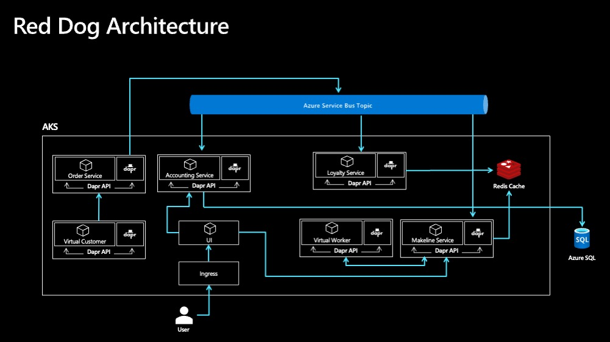
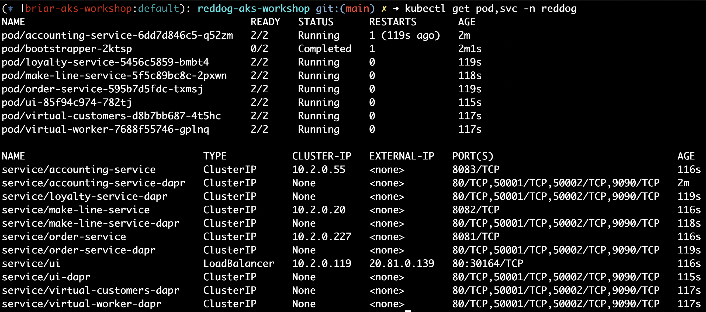
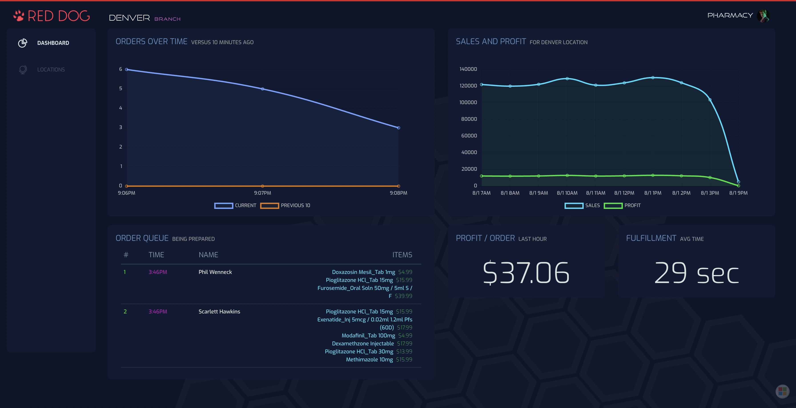

# Application Manifests and Deployment

## App Architecture



Red Dog Overview:

* Red Dog is a series of microservices that support a fictitious Retail Company 
* Each microservice runs as a container and is planned for Kubernetes in Azure
* This is an event driven architecture using Azure Service Bus for pub/sub
* Redis Cache is used to store state for some of the services
* Azure SQL is used to store the full order history
* The UI Dashboard shows the current activity of the business
* There are 2 background services used to simulate activity. Virtual Customer creates orders and Virtual Worker processes and fulfills orders
* The services use the Distributed Application Runtime [(Dapr)](http://dapr.io) as a sidecar for various actions

## Application Pre-requisites

Deploy the following before deploying Red Dog.

* Azure Service Bus (Standard SKU)
* SQL Azure
    * The database itself should be called `reddog`
    * Keep the server name, id, and password handy. We will create a connect string later
* Redis Cache (deploy in your AKS cluster via Helm)
    * Guide: https://bitnami.com/stack/redis/helm 
    * You can use Azure Redis Cache here. It takes a little longer to deploy, so we planned to just use Redis in cluster
* Dapr https://docs.dapr.io/operations/hosting/kubernetes/kubernetes-deploy/#install-with-helm-advanced

## Kubernetes Secrets Requirements

For simplicity, we will just use Kubernetes secrets to allow Red Dog services to connect to the above resources. Longer term, we would want to use Azure Key Vault for secure storage. This will be covered in a future lab.

Two secrets are required to deploy the app (everything must be created in the `reddog` namespace):

1. `reddog.secrets` with the following keys:
    * Service Bus connection string (key: `sb-connect-string`)
    * Redis server FQDN (key: `redis-server`)
    * Redis password (key: `redis-password`)

        ```bash
        SB_CONNECT_STRING=$(az servicebus namespace authorization-rule keys list --resource-group $RG --namespace-name $SB_NAMESPACE --name RootManageSharedAccessKey --query primaryConnectionString --output tsv)

        kubectl create secret generic reddog.secrets \
            --namespace reddog \
            --from-literal=sb-connect-string=$SB_CONNECT_STRING \
            --from-literal=redis-password=$REDIS_PASSWD \
            --from-literal=redis-server=$REDIS_SERVER 
        ``` 

2. `reddog-sql` with the following key:
    * SQL Connect String (key: `reddog-sql`)

        ```bash
        SQLSERVER=YOUR_SQL_HOSTNAME_GOES_HERE
        SQLLOGIN=YOUR_SQL_USERNAME_GOES_HERE
        SQLPASSWORD=YOUR_SQL_PASSWORD_GOES_HERE
        SQL_CONNECTION_STRING="Server=tcp:${SQLSERVER}.database.windows.net,1433;Database=reddog;User ID=${SQLLOGIN};Password=${SQLPASSWORD};Encrypt=true;Connection Timeout=30;"

         kubectl create secret generic reddog-sql \
            --namespace reddog-retail \
            --from-literal=reddog-sql="$SQL_CONNECTION_STRING"
        ```

## Application Requirements

The YAML files needed to deploy Red Dog are provided in this repo (manifests folder).

* Everything should be deployed into a namespace called `reddog` 
* Resource requests/limits are required and must be added to the deployment manifests. Think about total cluster resources and ensure that everything can be run in the cluster
    * For the purposes of this workshop, you can just add these requests/limits to just one of the services
* Deploy the Dapr components first

    ```bash
    kubectl apply -f ./manifests/workshop/dapr-components
    ```
* Set RoleBindings for Dapr to work properly

    ```bash
    kubectl apply -f ./manifests/workshop/reddog-services/rbac.yaml
    ```

## Tasks:

1. Deploy the above pre-requisites in your AKS cluster
2. Create 2 secrets in your AKS cluster with the necessary credentials as above
3. Update the Red Dog manifests and deploy everything into your AKS cluster
4. Add resource requests/limits for one of the services (order-service)
5. Add a health check for one of the services

When the deploy is successful, you should see the following in the cluster and the UI:




