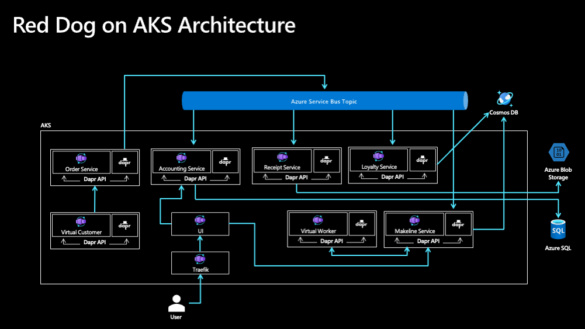

# Application Manifests and Deployment

## App Architecture

## Challenge #1

Goal: Deploy the Red Dog application to your AKS cluster

Notes:
* The YAML files needed to deploy Red Dog are provided in this repo
* Deploy Azure Services (Service Bus, SQL, etc.)
* Kubernetes secrets
* Explain Dapr

