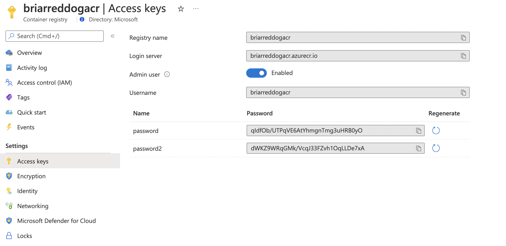
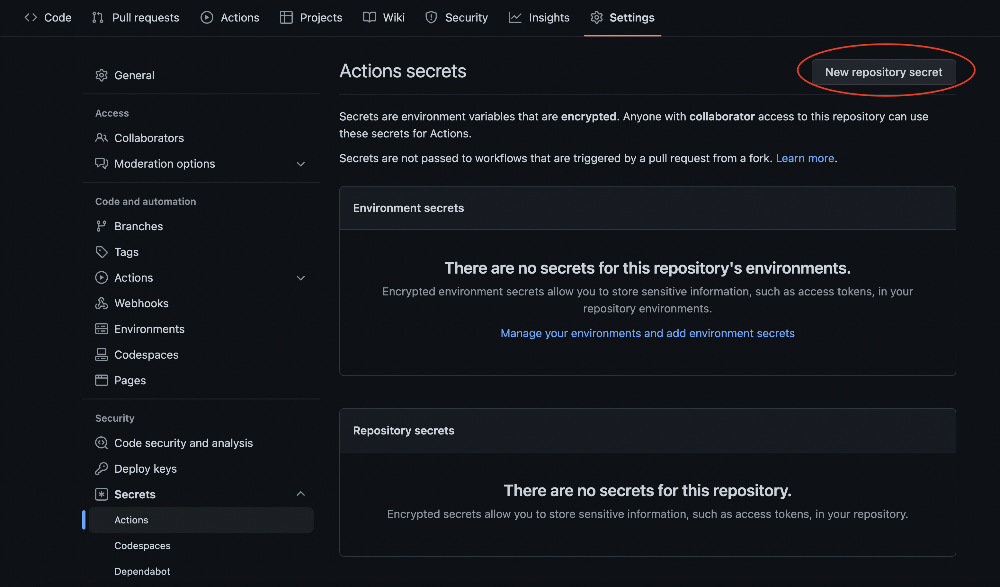
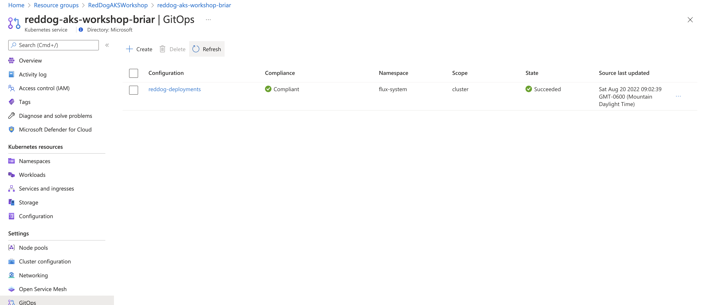

## CI/CD and GitOps Cheatsheet

### Fork the GitHub Repo

Fork this repo into your GitHub account: https://github.com/CloudNativeGBB/reddog-code

```bash
# clone the repo into your local environment
git clone https://github.com/chzbrgr71/reddog-code reddog-code-chzbrgr71

mkdir -p .github/workflows
```

### Add a GitHub Action

Again, in this workshop, you could just package and deploy a single service for simplicity. It may make sense to create separate workflows for each service.

Note that we are using the Azure Container Registry for access control here. This is a good discussion topic as there are other ways to approach this.

* Configure the Admin Account in your Azure Container Registry

    
* Create secrets in Github for the above account

    

    * ACR_ENDPOINT (the login server, eg - `briarreddogacr.azurecr.io`)
    * ACR_USERNAME
    * ACR_PASSWORD
* Setup manifests to be used with GitOps
    * Add a `manifests/deployments` directory to your repo 
    * Copy the `accounting-service.yaml` into the folder
    * Modify the image in the yaml file to the ACR image (eg - `briarreddogacr.azurecr.io/reddog-retail-demo/reddog-retail-accounting-service:latest`). Note that this value will be 
    updated by your CI pipeline
* Create a workflow file called: `./.github/workflows/package-order-service.yml`  
* Add workflow steps: 
    * Setup environment and metadata for image (tags, repo, etc.)
    * Build Docker image
    * Push to Azure Container Registry
    * Update the `accounting-service.yaml` file with the new tag
* Run workflow manually in GitHub and ensure images are pushed to your ACR and the manifest is updated with the new tag
* Test the workflow with a commit to the Accounting Service code
* The final workflow file should look like [package-accounting-service.yml](./cicd/package-accounting-service.yml)

### Configure GitOps (Flux v2)

In this step, you will setup AKS GitOps to pull the above created image as updates occur.

* First, remove the existing accounting-service

    ```bash
    kubectl delete deploy accounting-service -n reddog
    ```

* Flux v2 uses [Kustomize](https://kustomize.io). You will need to configure `kustomization.yaml` files in each directory
* Follow this guide to setup GitOps in your AKS cluster. https://docs.microsoft.com/en-us/azure/azure-arc/kubernetes/tutorial-use-gitops-flux2

    ```bash

    # setup extension
    az feature register --namespace Microsoft.ContainerService --name AKS-ExtensionManager
    az provider register --namespace Microsoft.Kubernetes
    az provider register --namespace Microsoft.ContainerService
    az provider register --namespace Microsoft.KubernetesConfiguration

    # ensure the provider is "Registered" before moving forward
    az provider show -n Microsoft.KubernetesConfiguration -o table

    Namespace                          RegistrationPolicy    RegistrationState
    ---------------------------------  --------------------  -------------------
    Microsoft.KubernetesConfiguration  RegistrationRequired  Registered

    # enable/update CLI extensions
    az extension add -n k8s-configuration
    az extension add -n k8s-extension
    az extension update -n k8s-configuration
    az extension update -n k8s-extension

    # add a Flux configuration 
    CLUSTER_NAME=reddog-aks-workshop-your-cluster-name
    RG=RedDogAKSWorkshop

    az k8s-configuration flux create \
    --resource-group $RG \
    --cluster-name $CLUSTER_NAME \
    --cluster-type managedClusters \
    --scope cluster \
    --name reddog-deployments \
    --namespace flux-system \
    --url https://github.com/chzbrgr71/reddog-code.git \
    --branch main \
    --kustomization name=kustomize path=./manifests/deployments prune=true 
    ```
* Once completed, you will see the GitOps config in the portal
    
    

* Validate the Flux control plane in your cluster in the flux-system namespace

    ```bash
    kubectl get pod -n flux-system

    NAME                                      READY   STATUS    RESTARTS   AGE
    fluxconfig-agent-5d98b7c568-zfrvj         2/2     Running   0          8m24s
    fluxconfig-controller-cd6444dd9-z2xfl     2/2     Running   0          8m24s
    helm-controller-75988fc95c-g96zg          1/1     Running   0          8m24s
    kustomize-controller-5d7d58477f-tz648     1/1     Running   0          8m23s
    notification-controller-88879667f-4s4k8   1/1     Running   0          8m24s
    source-controller-7896dfc4b7-c2tsg        1/1     Running   0          8m24s
    ```

* Validate the accounting-service. This can take a while to sync
    
    ```bash
    kubectl get pod -n reddog

    NAME                                  READY   STATUS    RESTARTS        AGE
    accounting-service-7499686fc7-hvs26   2/2     Running   1 (2m55s ago)   3m2s
    loyalty-service-5456c5859-vkj9t       2/2     Running   8 (9d ago)      9d
    make-line-service-5f5c89bc8c-hmwsm    2/2     Running   0               9d
    order-service-595b7d5fdc-7qlzz        2/2     Running   0               8d
    ui-85f94c974-lglx2                    2/2     Running   0               9d
    virtual-customers-d8b7bb687-h2gbq     2/2     Running   0               9d
    virtual-worker-7688f55746-mmw92       2/2     Running   0               8d
    ```

### Example

The full working example is available in this fork: https://github.com/chzbrgr71/reddog-code
