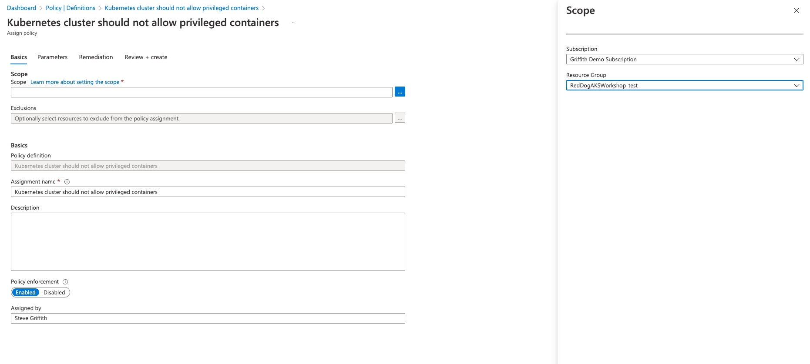

## Cluster Policy Cheatsheet

In cluster policy, you were given the following requirements:

* Azure Policy for AKS must be enabled on the cluster
* Creation of privileged pods should be blocked for all namespaces except kube-system, gatekeeper-system and azure-arc
* The scope of the policy assignment should be only the resource group where the AKS cluster is deployed
  
You were asked to complete the following tasks:

1. Enable Policy on the AKS Cluster
2. Apply the privileged pod policy at the cluster level
3. Test the policy is operating as expected


### Enable Policy on the AKS Cluster

```bash
# First ensure that the addon isnt already installed
# Some organizations have it enabled by default in their enterprise wide Azure Policy
az aks addon list -g $RG -n $CLUSTER_NAME

# Output
Name                             Enabled
-------------------------------  ---------
http_application_routing         False
monitoring                       False
virtual-node                     False
kube-dashboard                   False
azure-policy                     False
ingress-appgw                    False
confcom                          False
open-service-mesh                False
azure-keyvault-secrets-provider  False
gitops                           False
web_application_routing          False

# Enable the addon
az aks enable-addons \
--addons azure-policy \
--resource-group $RG \
--name $CLUSTER_NAME

# Confirm it was enabled
az aks addon list -g $RG -n $CLUSTER_NAME |grep azure-policy
azure-policy                     True

kubectl get pods -n kube-system|grep policy
azure-policy-5b9948fb7f-pjtvz                        1/1     Running   0          2m57s
azure-policy-webhook-854ffcbfdb-m47l9                1/1     Running   0          2m57s
```

### Apply the privileged pod policy at the cluster level

First you should test that you ARE able to create a priviledged pod, before enabling the policy.

```bash
# Create the pod inline, or use the manifest below to create a yaml file and deploy that
cat <<EOF | kubectl apply -n default -f -
apiVersion: v1
kind: Pod
metadata:
  name: nginx-privileged
spec:
  containers:
    - name: nginx-privileged
      image: mcr.microsoft.com/oss/nginx/nginx:1.15.5-alpine
      securityContext:
        privileged: true
EOF

# Check that it started
kubectl get pods -n default

# Output
NAME               READY   STATUS    RESTARTS   AGE
nginx-privileged   1/1     Running   0          74s

# Delete the pod
kubectl delete pod nginx-privileged
```

Now enable the policy. Policies are most easily managed in the Azure Portal. 

1. Navigate to [https://portal.azure.com](https://portal.azure.com)
2. In the top search bar type 'Policy' and then select 'Policy'

    

3. Click on 'Definitions' in the left pane

    

4. In the Policy Definition search field, type 'privileged'

    

5. Click on the policy definition and then in the policy definition page select 'Assign'

    

6. In the policy assignment window, click the 'Scope' field and select the subscription and resource group for the AKS cluster.

    

7. Click on the 'Parameters' tab and check that the exclusions are correct.

    

8. Click 'Review + Create' and then 'Create'

> **NOTE**
> It may take up to 20 minutes before the policy goes into effect, so it may be a good time for a coffee break.


### Test the policy is operating as expected

```bash
# Try to create the privileged pod again
cat <<EOF | kubectl apply -n default -f -
apiVersion: v1
kind: Pod
metadata:
  name: nginx-privileged
spec:
  containers:
    - name: nginx-privileged
      image: mcr.microsoft.com/oss/nginx/nginx:1.15.5-alpine
      securityContext:
        privileged: true
EOF

# Output
Error from server (Forbidden): error when creating "STDIN": admission webhook "validation.gatekeeper.sh" denied the request: [azurepolicy-k8sazurecontainernoprivilege-c764d684265a1f1355ce] Privileged container is not allowed: nginx-privileged, securityContext: {"privileged": true}

# Now change the namespace for the pod to kube-system
cat <<EOF | kubectl apply -n kube-system -f -
apiVersion: v1
kind: Pod
metadata:
  name: nginx-privileged
spec:
  containers:
    - name: nginx-privileged
      image: mcr.microsoft.com/oss/nginx/nginx:1.15.5-alpine
      securityContext:
        privileged: true
EOF

# Output
pod/nginx-privileged created

# Check the pod is running
kubectl get pods -n kube-system|grep nginx
nginx-privileged                                     1/1     Running   0          18s

```
