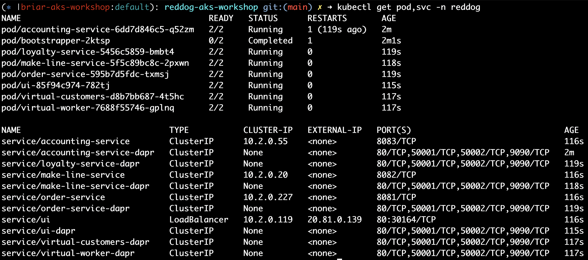
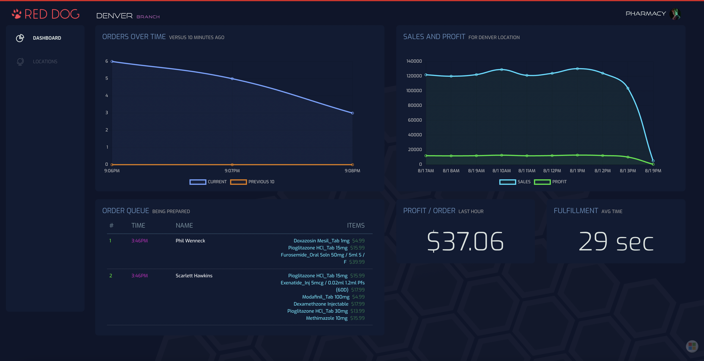

# Red Dog AKS Workshop
---
## Purpose of this repository

Hands-on workshop to guide learning Azure Kubernetes Service (AKS) and deploy successful cloud native applications.

This repository leverages the [reddog applicaton codebase](https://github.com/Azure/reddog-code) and is created by the Global Black Belt Team from Microsoft.

---
## Prerequisites

* Access to an Azure Subscription
* Access to Azure Cloud Shell
  * [https://shell.azure.com/](https://shell.azure.com/)

---
## Workshop Modules

* [Environment Preparation](./docs/environment-prep.md)
* [Cluster Creation & Nodepool Design](./docs/cluster-creation.md)
* [Application Manifests and Deployment](./docs/app-deployment.md)
* [Monitoring & Logging](./docs/monitoring.md)  
* [Networking](./docs/ingress.md)
* [Image Management & Container Registry](./docs/container-registry.md)
* [CI/CD & GitOps](./docs/cicd-gitops.md)
* [Autoscaling](./docs/autoscaling-setup.md)
* [AKS Cluster Management](./docs/cluster-upgrades.md)

---
# Environment Preparation
---
# Environment Preparation
#### Network Planning Requirements:

Azure Kubernetes Service ultimately runs on virtual machines, and those virtual machines live in a subnet within an [Azure Virtual Network](https://docs.microsoft.com/en-us/azure/virtual-network/virtual-networks-overview). For this workshop we'll assume the following network requirements:

* You've been given the following address space to use for your environment 
  * ```10.140.0.0/16```

---

# Environment Preparation
#### Identity Planning Requirements:


* The cluster identity, used to make infrastructure changes should be a managed identity
* The cluster identity should have ```Contributor``` rights on the Resource Group
* The identity used to pull images from the Azure Container Registry (i.e. the Kubelet identity) should be a managed identity

---
# Environment Preparation
#### Tasks:

1. Create the Resource Group and Azure Virtual Network and subnet that will be used for your AKS cluster. 

2. Get the resource ID for the subnet where the AKS cluster will be deployed.
3. Create a managed identity for the cluster in the cluster resource group, with the rights documented in the requirements.
4. Create a managed identity to be used by Kubelet to pull images (**NOTE:** We'll set permissions for this identity in a later step.)

---
# Environment Preparation
#### Next:

* **Option 1:** Continue to [Egress Lockdown](./egress-lockdown.md) setup
* **Option 2:** Jump ahead to [Cluster Creation](./cluster-creation.md)

---
# Cluster Creation

---
# Cluster Creation
#### Overview:

In previous steps you should have created the network and identity foundations for your cluster. You may have also set up the infrastructure for egress lockdown, including the Azure Firewall and rules required by AKS. Now it's time to bring those together in creation of an AKS cluster.

---
# Cluster Creation
####  AKS Cluster Requirements:

* The cluster must be created in the `aks` subnet you created previously
* The cluster should use the following address spaces:
    * Pod CIDR: 10.244.0.0/16
    * Service CIDR: 10.245.0.0/24
    * DNS Service IP: 10.245.0.10
---
# Cluster Creation
####  AKS Cluster Requirements:
* The cluster should use the cluster and kubelet identities you've already created
* The cluster should be configured to use ```calico``` Kubernetes Network Policy
* The cluster should have both a ```System``` and ```User``` mode nodepool
* The initial pool created will be the system pool and should be called ```systempool```
* The ```System``` nodepool should be tainted to only allow system pods
---
# Cluster Creation
####  AKS Cluster Requirements:
* **If you followed the egress lockdown path**, the cluster should be configured so that outbound traffic uses the route table you've created which forces internet traffic to the Azure Firewall, otherwise you can use the default cluster egress model.
---
# Cluster Creation
#### Task:

1. Using the requirements above, construct a command to deploy your AKS cluster (Review with your proctor before deploying)
2. Deploy the cluster
3. Get the cluster credentials and check that all nodes are in a 'READY' state and all pods are in 'Running' state
---
# Cluster Creation
#### Next:

[Application Manifests and Deployment](app-deployment.md)

---
# Application Manifests and Deployment
---


<!---
#### Red Dog Overview:

* Red Dog is a series of microservices that support a fictitious Retail Company 
* Each microservice runs as a container and is planned for Kubernetes in Azure
* This is an event driven architecture using Azure Service Bus for pub/sub
* Redis Cache is used to store state for some of the services
* Azure SQL is used to store the full order history
* The UI Dashboard shows the current activity of the business
* There are 2 background services used to simulate activity. Virtual Customer creates orders and Virtual Worker processes and fulfills orders
* The services use the Distributed Application Runtime [(Dapr)](http://dapr.io) as a sidecar for various actions
--->
---
# Application Manifests and Deployment
#### Application Pre-requisites

Deploy the following before deploying Red Dog.

* Azure Service Bus (Standard SKU)
* SQL Azure
* Redis Cache (deploy in your AKS cluster via Helm)
* Dapr 

---
# Application Manifests and Deployment
#### Kubernetes Secrets Requirements

Two secrets are required to deploy the app (everything must be created in the `reddog` namespace):

1. `reddog.secrets` with the following keys:
    * Service Bus connection string (key: `sb-connect-string`)
    * Redis server FQDN (key: `redis-server`)
    * Redis password (key: `redis-password`)


2. `reddog-sql`

---
# Application Manifests and Deployment
#### Application Requirements

The YAML files needed to deploy Red Dog are provided in this repo (manifests folder).

* Everything should be deployed into a namespace called `reddog` 
* Resource requests/limits are required and must be added to the deployment manifests. Think about total cluster resources and ensure that everything can be run in the cluster
    * For the purposes of this workshop, you can just add these requests/limits to just one of the services
* Deploy the Dapr components first

    ```bash
    kubectl apply -f ./manifests/workshop/dapr-components
    ```
* Set RoleBindings for Dapr to work properly

    ```bash
    kubectl apply -f ./manifests/workshop/reddog-services/rbac.yaml
    ```
---
# Application Manifests and Deployment
#### Tasks:

1. Deploy the above pre-requisites in your AKS cluster
2. Create 2 secrets in your AKS cluster with the necessary credentials as above
3. Update the Red Dog manifests and deploy everything into your AKS cluster
4. Add resource requests/limits for one of the services (order-service)
5. Add a health check for one of the services
---
When the deploy is successful, you should see the following in the cluster and the UI:



---


---
# Application Manifests and Deployment
#### Next: 

[Monitoring / Logging](docs/monitoring.md)